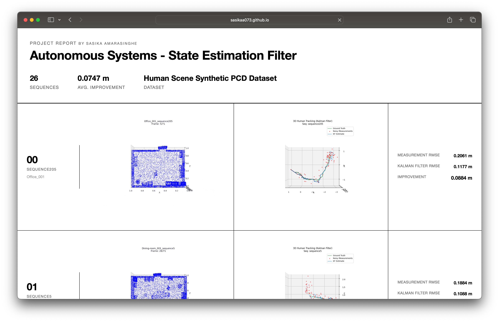

# Autonomous Systems - State Estimation Filter

This project implements a 3D human tracking system using Point Cloud Data (PCD) and a Kalman Filter for state estimation. It processes sequences of human movement, detects bounding boxes, and applies a Kalman Filter to smooth the noisy measurements, improving the accuracy of the tracking.

## Features

*   **Data Pipeline**: Automatically filters and processes "walking" sequences from the Unified Dataset.
*   **State Estimation**: Utilizes a Kalman Filter (Prediction & Update) to estimate the true position of the subject, filtering out simulated measurement noise.
    *   **Process Noise**: 0.05
    *   **Measurement Noise**: 0.5
*   **Visualization**:
    *   Generates Top-View GIFs of the point cloud and tracking results.
    *   Creates 3D tracking plots comparing Ground Truth, Noisy Measurements, and Kalman Filter Estimates.

## Requirements

*   Python 3.x
*   `numpy`
*   `matplotlib`

## Usage

### 1. Run Tracking and Visualization

To process the sequences, run the Kalman Filter tracking script:

```bash
python run_tracking_KF_with_sequence_GIF.py
```

This will:
1.  Load the dataset.
2.  Filter for relevant sequences (e.g., 'walking').
3.  Generate GIFs and tracking plots in the `output/` directory.
4.  Save numerical results (RMSE values) to text files.

### 2. Generate Web Report

After processing the sequences, generate the HTML report:

```bash
python generate_web_report.py
```

This will create `docs/index.html` and copy the necessary assets to `docs/assets/`. You can open `docs/index.html` in your web browser to view the comprehensive report including animations and metrics.

## Results

The system calculates the Root Mean Square Error (RMSE) for both the raw measurements and the Kalman Filter estimates. The improvement metric demonstrates the effectiveness of the filter in reducing noise.

For a detailed visual and numerical breakdown, please refer to the generated [Web Report](docs/index.html).
